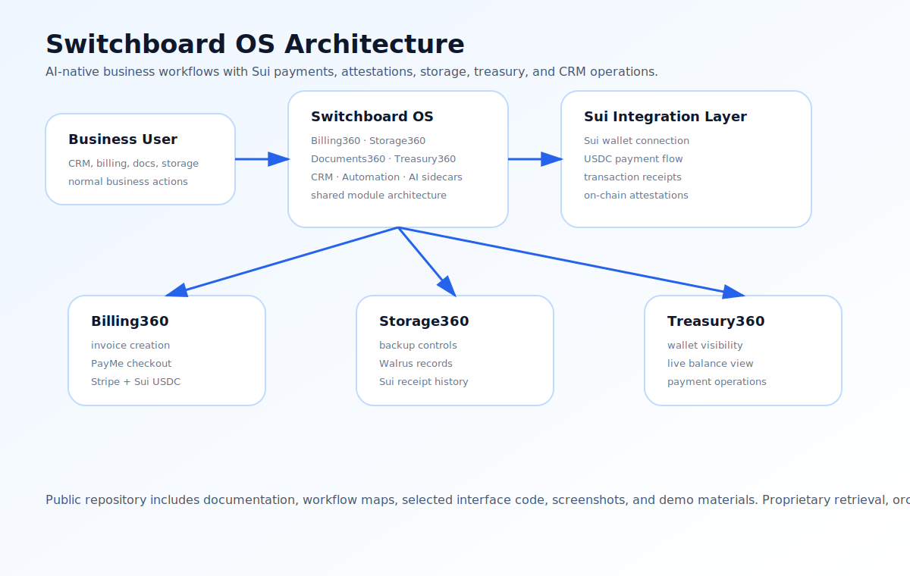
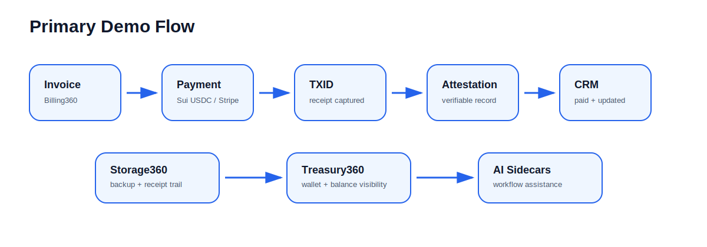

# Switchboard OS

Demo Proofs 

https://suivision.xyz/account/0xcfd61e24943e826f61dca8f6ec540bb505c9da72d7a53b2637dbd332b2e7f6b5?tab=Activity        backups and attestations

https://suivision.xyz/account/0x1c72d3d74d9b06683935d9ae7077cb489833550cfbb75c4e0a1c16f35d86e440?tab=Activity       recieved payment

https://suivision.xyz/account/0x33f249da5380009bc04c567deb12dec9b57586ab3eede39a441e6fdad5fbd644?tab=Activity       paid invoice 



**Switchboard OS** is an AI-native business operating system that connects CRM, billing, storage, treasury operations, document workflows, communications, automation, and blockchain infrastructure into one modular platform.

The hackathon demo focuses on a simple thesis:

> Web3 should not force everyday businesses to behave like crypto apps.  
> It should quietly support real operations in the background: payments, receipts, storage, attestations, and financial visibility.

Switchboard demonstrates this by turning normal business workflows into verifiable, wallet-aware, Sui-enabled workflows.

---

## Demo Workflows



### 1. Invoice → Sui USDC Payment → CRM Update

A user creates an invoice inside **Billing360**, launches the payment surface, pays with **Sui USDC**, captures the transaction ID, and updates the CRM invoice/payment state.

### 2. Business Record → Attestation → Verifiable Receipt

A business event, invoice, backup, or document action can be connected to a verifiable receipt trail. The goal is to make operational history inspectable without forcing users to manually manage blockchain complexity.

### 3. Storage360 → Backup → Sui Receipt Trail

**Storage360** manages business backup records, backup controls, Walrus-oriented storage flows, and Sui receipt history from inside the same operating system.

### 4. Treasury360 → Wallet Visibility → Payment Context

**Treasury360** displays connected Sui wallet state, live balance visibility, and payment/treasury context after invoices and attestations flow through the platform.

### 5. AI Sidecars → Workflow Assistance

Module-level AI sidecars assist with navigation, context, execution planning, and operational guidance inside the CRM environment.

---

## What Makes This Different

Most Web3 applications start with the wallet.

Switchboard starts with the **business workflow** and places Web3 infrastructure underneath it.

```text
Customer
  ↓
Invoice
  ↓
Payment
  ↓
TXID / Receipt
  ↓
Attestation
  ↓
Storage / Treasury
  ↓
CRM Intelligence
```

The result is not a standalone crypto app. It is business software with blockchain receipts, payment events, attestations, wallet activity, storage records, and AI workflows built into the operating layer.

---

## Public Repository Scope

This repository contains public demonstration materials, architecture documentation, workflow maps, module summaries, selected implementation surfaces, and evaluation context.

Certain proprietary systems are intentionally excluded, including:

- internal retrieval infrastructure
- graph generation systems
- Runtime-C orchestration
- Tracer asset warehouse internals
- resource-pack assembly pipelines
- private deployment infrastructure
- internal prompts and AI workflow tooling
- large vector/corpus indexes
- private customer or operational data

Additional architecture walkthroughs, implementation review, private code inspection, and server demonstrations are available upon request for judges, partners, ecosystem teams, investors, and technical reviewers.

---

## Repository Layout

```text
.
├── README.md
├── docs
│   ├── 00_PROJECT_OVERVIEW.md
│   ├── 01_WORKFLOWS.md
│   ├── 02_ARCHITECTURE.md
│   ├── 03_FILESYSTEM_MAP.md
│   ├── 04_MODULES.md
│   ├── 05_SUI_INTEGRATION.md
│   ├── 06_STORAGE360.md
│   ├── 07_BILLING360.md
│   ├── 08_RUNTIME_C_AND_RETRIEVAL.md
│   ├── 09_DEMO_SCRIPT.md
│   ├── 10_TECHNICAL_REVIEW.md
│   └── 11_ROADMAP.md
├── assets
│   ├── switchboard-architecture.svg
│   └── workflow-map.svg
└── source-material
    └── original architecture and build notes
```

---

## Status

Switchboard is an active development platform. The submitted build demonstrates the main workflow loop and Sui integration surface, while some modules remain under active construction.

The platform is presented as a working product prototype with private infrastructure and selected public documentation.
