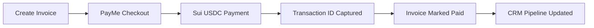
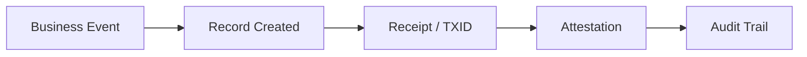
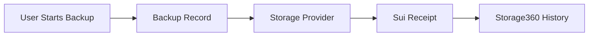
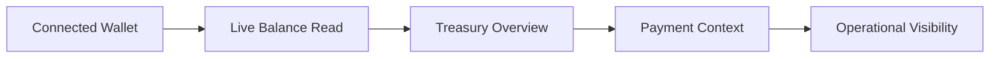
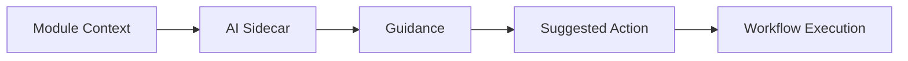

# Switchboard Demo Workflows

## Workflow 1: Invoice to Sui USDC Payment

This workflow demonstrates how a business invoice can be paid through a blockchain-native payment surface while still behaving like a normal business transaction inside the CRM.

## Workflow 2: Business Record to Attestation

The platform can connect records such as invoices, backups, and document events to verifiable proof records.

## Workflow 3: Storage360 Backup Flow

Storage360 provides a business-facing control surface for backup records and receipt visibility.

## Workflow 4: Treasury360 Visibility

Treasury360 is the financial visibility layer for the platform, connecting wallet activity to business operations.

## Workflow 5: AI Sidecar Assistance

AI sidecars support the user inside each module instead of forcing them to leave the workflow to ask a separate assistant.
